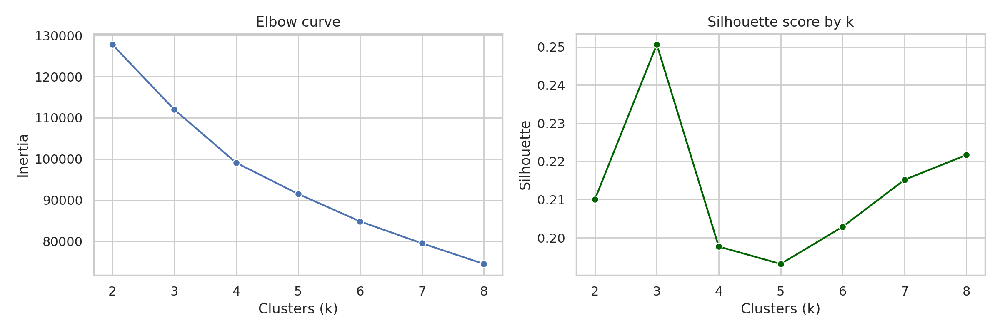
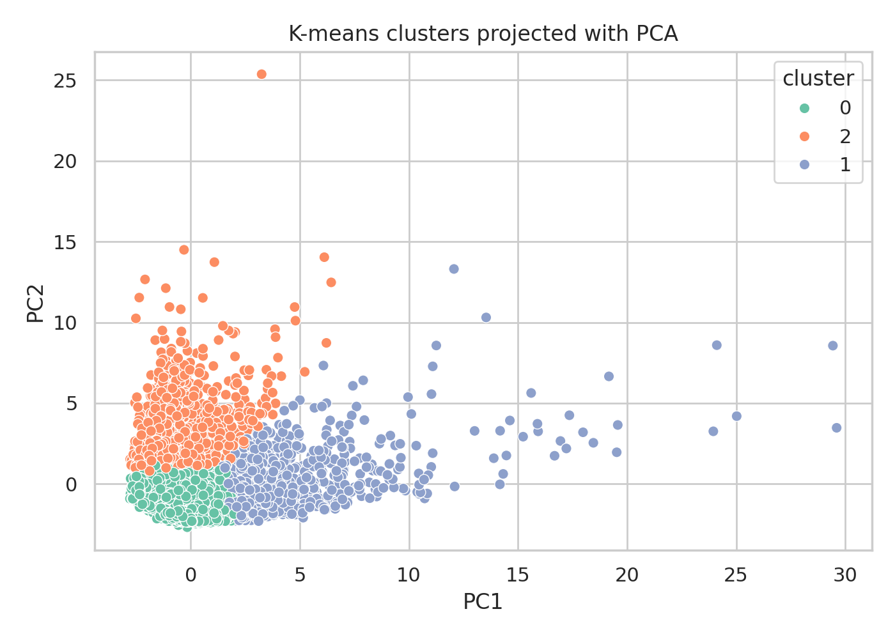
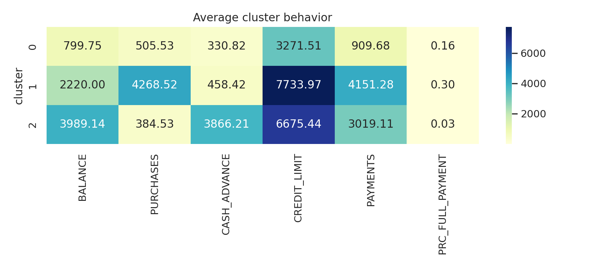
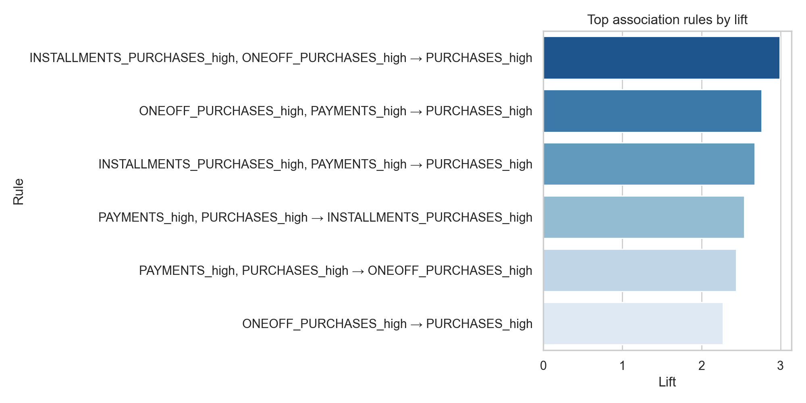

# Technical Report: Credit Card Customer Segmentation

## Problem statement

In this project, I will discuss three forms of data-mining methods. I will also use unsupervised learning on the credit card clustering data set. Using the data set, I will try to find different customer segments. The implementation will consist of K-means clustering to segment the data. In addition, I will show association rules to demonstrate common behavior that supports the clusters.

## Part I: Data-mining techniques

1- Clustering segments unlabeled records based on similarity. Features like spending, balances, and payment behavior are compared between records, and nearby observations are grouped into the same cluster. Its strengths are its exploratory ability on unlabeled data; its weaknesses are the reliance on feature scaling and human-defined parameters like number of clusters.

2- Association is used to find co-occurring events. Often calculated with support, confidence, and lift. It is strong with market-basket style insights, or unique behavioral combinations. But weak if your data is not transactional, or if many useless rules are generated.

3- Correlation analysis determines how strongly variables change together. Typically uses Pearson or Spearman coefficients. Its used to find redundant variables and relationships. Correlation obviously does not imply causation, and it can fail to identify nonlinear structure.

For example: Customer segmentation of a bank database (Clustering), finding product bundles in a supermarket transaction database (Association), and determining how much Credit Limits and Payments move together in a finance dataset (Correlation).

## Part II: Algorithm of the solution

The Python workflow is implemented in `/tmp/workspace/Faus7679/data-mining-clustering/credit_card_analysis.py`.

```python
# Core execution flow
raw_df = pd.read_csv(dataset_path)
clean_df, missing_df = preprocess(raw_df)
clustered_df, metrics_df, cluster_summary_df = build_kmeans_outputs(clean_df)
rules_df = build_association_rules(clean_df)
```

Script imports pandas, scikit-learn, matplotlib, seaborn, and mlxtend. Then dataset CreditCardDataSetforClustering.csv was read either from provided path or public mirror of the same credit card dataset. After preprocessing identifier CUST_ID was removed, fields were converted into numeric forms. Data was imputed using medians (MISSING VALUES: MINIMUM_PAYMENTS - 313, CREDIT_LIMIT - 1) and scaled so every numeric column was standardized. Scaling was necessary due to variables like BALANCE and PURCHASES_TRX being vastly different magnitudes. 

K- means was scored using inertia and silhouette score for k = 2..8. Clusters were picked using the silhouette score, which was maximized at k = 3 (Silhouette Score: 0.2506). Model was then fit to predict cluster labels for each customer. 
In order to visualize data, the scaled data was projected to just two principal components. Same dataset was discretized low medium or high bands for balance, purchases, cash advance, payments, and no-at-limit rate to meet assignment's association- rule requirements, then Apriori was run on this data.

## Quantitative outputs

```text
Selected k: 3
Cluster sizes: 6119, 1235, 1596

Cluster 0 -> lower-balance, lower-spend customers
Cluster 1 -> high-purchase, high-payment customers
Cluster 2 -> cash-advance-heavy revolving customers
```

| Cluster | Size | Avg Balance | Avg Purchases | Avg Cash Advance | Avg Credit Limit | Avg Payments |
| --- | ---: | ---: | ---: | ---: | ---: | ---: |
| 0 | 6119 | 799.75 | 505.53 | 330.82 | 3271.51 | 909.68 |
| 1 | 1235 | 2220.00 | 4268.52 | 458.42 | 7733.97 | 4151.28 |
| 2 | 1596 | 3989.14 | 384.53 | 3866.21 | 6675.44 | 3019.11 |

The top association rules revealed that large one-off purchases very strongly predict high overall purchases. Additionally, low one-off spending and low installments spending also predict low overall spending. These rules validate our cluster interpretation by highlighting frequent combinations of behavior within our customer base.

## Plots

Files are stored in `/tmp/workspace/Faus7679/data-mining-clustering/outputs/` and embedded below with repository-relative paths for Markdown rendering.






## Analysis of findings

As shown in the results, there are three ideal customer segments that can be acted upon. Cluster 0 is made up of the largest proportion of customers and indicates moderate or no card usage. Cluster 1 contains valuable transactors that buy frequently and make large payments. Cluster 2 would be the risk focused segment as balances and cash advances are both high, while purchases are low compared to the other clusters and `PRC_FULL_PAYMENT` is around 0. From a business standpoint, the bank could market premium rewards to Cluster 1, provide Cluster 0 with card activation offers, and reach out to Cluster 2 for repayment assistance or risk management educational programs.

Adjustments were made to clustering by testing a variety of `k` values rather than presupposing there was only one correct solution. While inertia continued to improve as k increased, silhouette value peaked at k = 3 which was the best balance of cluster separation and interpretability. Minimum support and confidence thresholds were also set when generating association rules to ensure only the highest value, non-trivial rules were kept.

## References

1. Han, J., Kamber, M., & Pei, J. *Data Mining: Concepts and Techniques*.
2. Pedregosa, F. et al. “Scikit-learn: Machine Learning in Python.”
3. Raschka, S. *mlxtend* documentation for Apriori and association rules.
4. Public mirror of the Credit Card Dataset for Clustering: `https://raw.githubusercontent.com/leonswl/credit-card-clustering/main/data/CC_GENERAL.csv`
